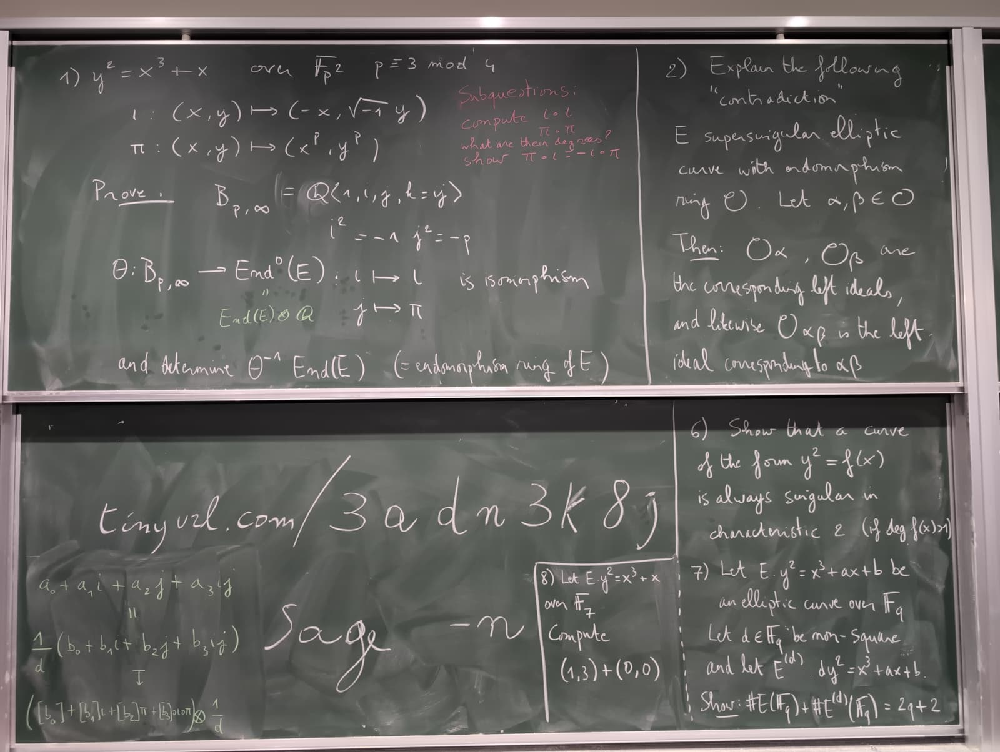
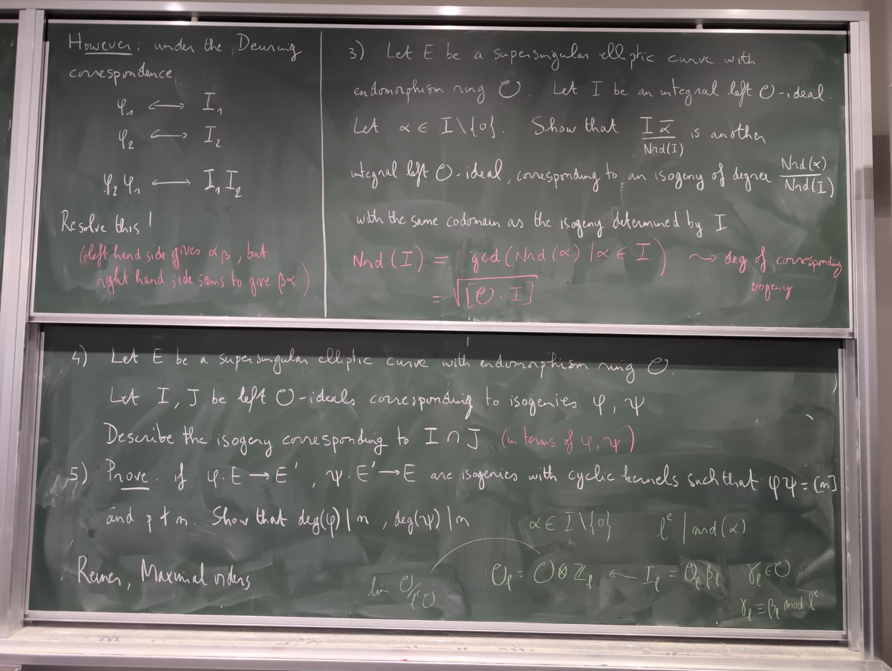

# OIST School: Introduction to Isogeny-based Cryptography

Link: https://groups.oist.jp/tsvp/event/school-introduction-isogeny-based-cryptography-tsvp-tp25ic

Soon here the exercises for the school.

## Blackboard exercises

### Day 1

## Sagemath exercises

These [Jupyter/Sagemath](https://www.sagemath.org/) notebooks contain
the tutorials and exercises for the "Cryptography" course of the
school.

- Day 1: [playing with elliptic curves and isogenies](2026-02-09-day1.ipynb)
- Day 2: [isogenies in dimension 1 and 2](2026-02-10-day2.ipynb)

### Install Sagemath

If you have the opportunity, it's recommended to install Sagemath on
your personal machine. Instructions at
<https://doc.sagemath.org/html/en/installation/index.html>.

### Use Sagemath in the cloud

If you couldn't install Sagemath, you can use the service above to run
it in the cloud for free.

#### Cocalc

[Cocalc](https://cocalc.com/) is a freemium cloud service providing
Sagemath and other scientific tools.  You will have to create an
account in order to use it.

You can open the tutorials in Cocalc by following this link:
<https://cocalc.com/github/defeo/cimpa-popayan>.

After you open a notebook, click on "Edit your own copy". It will
prompt you to create an account, if you haven't already done so, and
then import the notebook in a project.
